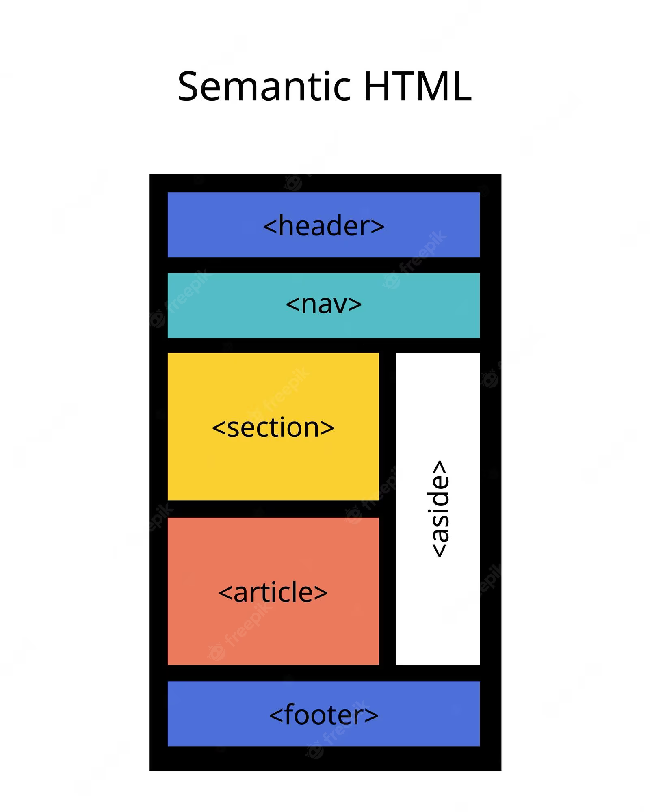
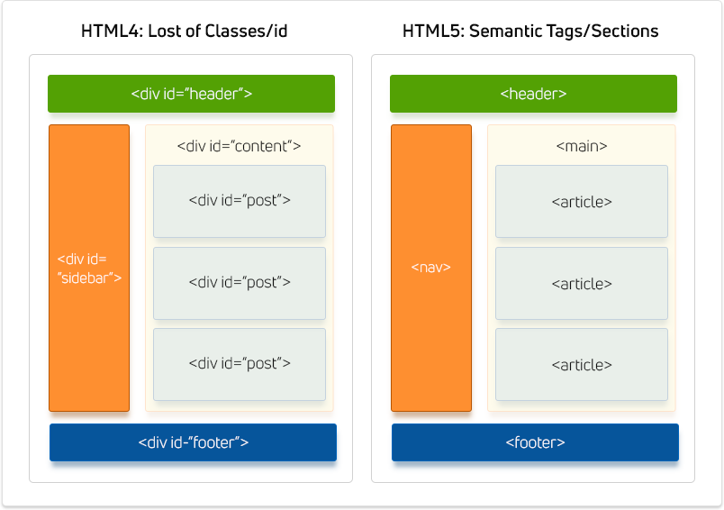

# Enhancing Web Development with Semantic HTML



Semantic HTML is a crucial aspect of web development, as it provides meaning and context to web pages. With the use of semantic tags, developers can create well-structured and easy-to-understand code, resulting in improved accessibility, SEO, and overall user experience. In this comprehensive guide, we will dive deep into the world of semantic HTML, exploring its significance, benefits, and best practices.

## Table of Contents

1. Understanding Semantic HTML
2. The Importance of Semantic HTML
3. Benefits of Using Semantic HTML
4. Common Semantic HTML Elements
   - Structural Elements
   - Text Elements
5. Semantic HTML for Accessibility
6. Semantic HTML and SEO
7. Semantic HTML Best Practices
   - Avoid Misusing Semantic Tags
   - Properly Nest and Order Elements
   - Separate Structure and Presentation
8. Examples of Semantic HTML Implementation
9. The Evolution of Semantic HTML: HTML4 vs. HTML5
10. Conclusion

## 1. Understanding Semantic HTML

Semantic HTML refers to the use of HTML tags that convey the meaning—or semantics—of the content contained within them. These tags clearly define the purpose and role of the content on the web page, making it easier for both developers and browsers to understand the structure and purpose of the content.

Using semantic HTML elements helps to create a well-structured and meaningful web page, as opposed to non-semantic HTML elements like `<div>` and `<span>`, which serve as content holders without providing any indication about the type of content they contain or its role on the page.

## 2. The Importance of Semantic HTML

Semantic HTML is essential for creating web pages that are easy to understand, navigate, and maintain. By using tags that accurately describe the content, developers can create cleaner code that is more accessible to both humans and machines. This results in a better user experience, improved search engine rankings, and easier code maintenance.

## 3. Benefits of Using Semantic HTML

There are several benefits to using semantic HTML, including:

1. **Improved SEO**: Search engines consider the contents of semantic elements as important keywords, influencing the page's search rankings.
2. **Accessibility**: Screen readers and other assistive technologies can use semantic elements as signposts to help visually impaired users navigate a page.
3. **Easier Code Maintenance**: Finding blocks of meaningful code is simpler when using semantic elements, as opposed to searching through endless `<div>` elements.
4. **Clearer Code Structure**: Semantic elements suggest the type of data that will be populated, making it easier for developers to understand the purpose of each section of a web page.

## 4. Common Semantic HTML Elements

Semantic HTML elements can be broadly divided into two categories: structural elements and text elements.

### 4.1 Structural Elements

These elements define the layout and structure of a web page. Some common structural elements include:

- `<header>`: Represents the header or introductory content of a page or section.
- `<nav>`: Contains the navigation links for a web page.
- `<main>`: Encompasses the main content of a web page.
- `<article>`: Represents a self-contained piece of content that can stand independently, such as a blog post or news article.
- `<section>`: Groups related content with a similar theme.
- `<aside>`: Contains supplementary information or content that is tangentially related to the main content.
- `<footer>`: Represents the footer of a page or section, often containing contact information, copyright notices, and additional navigation links.

### 4.2 Text Elements

Text elements provide semantic meaning to the text they contain. Some common text elements include:

- `<h1>` to `<h6>`: Heading and subheading elements, with `<h1>` being the most important and `<h6>` being the least important.
- `<p>`: Represents a paragraph of text.
- `<a>`: Defines a hyperlink.
- `<ol>` and `<ul>`: Ordered and unordered lists, respectively, with `<li>` representing individual list items.
- `<blockquote>` and `<q>`: Used for long and inline quotations, respectively.
- `<em>` and `<strong>`: Used for emphasized and strongly emphasized text, respectively.
- `<code>`: Represents a block of computer code.

## 5. Semantic HTML for Accessibility

Semantic HTML plays a crucial role in making web pages accessible to users with disabilities. By using meaningful tags, developers can make it easier for screen readers and other assistive technologies to interpret and present the content to users with visual impairments.

For example, using heading tags like `<h1>` and `<h2>` allows screen readers to understand the hierarchy of the content, making it easier for users to navigate through the page.

## 6. Semantic HTML and SEO


Search engines, such as Google, rely on semantic HTML to better understand the content of web pages. By using semantic tags, developers can provide search engine crawlers with more accurate information about the content, helping to improve the page's ranking on search engine results pages (SERPs) for relevant keywords.

In essence, pages with properly implemented semantic HTML have a competitive advantage in SEO over those that do not.

## 7. Semantic HTML Best Practices

To make the most of semantic HTML, developers should follow these best practices:

### 7.1 Avoid Misusing Semantic Tags

Do not use semantic tags for purely stylistic purposes. Some examples of incorrect usage include:

- Using `<h1>` to `<h6>` tags to change the font size of non-heading text.
- Using `<blockquote>` to indent non-quotation text.
- Applying `<strong>` or `<em>` to add bold or italics to text that doesn't require emphasis.

Instead, use CSS for styling purposes.

### 7.2 Properly Nest and Order Elements

Organize your semantic elements according to their intended purpose and hierarchy. For example, ensure that all `<h3>` headings that follow a certain `<h2>` heading are subtopics of that `<h2>` heading. This creates a logical hierarchy that helps both users and search engines better understand and navigate the content.

### 7.3 Separate Structure and Presentation

Semantic HTML focuses on the structure of the content, while CSS is responsible for the presentation. To maintain a clear separation between structure and presentation, avoid using HTML tags to style your content, and instead rely on CSS for all styling needs.

## 8. Examples of Semantic HTML Implementation

Here are some examples of how to implement semantic HTML in your web pages:

### 8.1 Correct usage of semantic elements

```html
    <!-- Correct usage of semantic elements -->
    <header>
      <nav>
        <!-- Navigation links -->
      </nav>
    </header>
    <main>
      <article>
        <h1>Article Title</h1>
        <p>Article content...</p>
      </article>
    </main>
    <footer>
      <!-- Footer content -->
    </footer>
```

### 8.2 Incorrect usage of semantic elements

```html
    <!-- Incorrect usage of semantic elements -->
    <div>
      <h1 style="font-size: 24px;">This is not a heading</h1>
      <p style="text-indent: 2em;">Indented text that is not a quotation</p>
      <span style="font-weight: bold;">Non-emphasized text</span>
    </div>
```

## 9. The Evolution of Semantic HTML: HTML4 vs. HTML5



The introduction of HTML5 brought a significant improvement to semantic HTML. Many new elements were introduced, such as `<header>`, `<nav>`, `<article>`, and `<section>`, which provide clearer definitions of the content and its purpose on the web page. These new elements make it even easier for both developers and browsers to understand the structure and meaning of the content.

## 10. Conclusion

Semantic HTML is an invaluable tool for creating well-structured, accessible, and SEO-friendly web pages. By using the appropriate semantic tags and following best practices, developers can create web pages that are easy to understand and maintain, resulting in a better user experience and improved search engine rankings. As you continue to develop your skills in web development, make sure to incorporate semantic HTML into your toolkit to ensure the success of your projects.